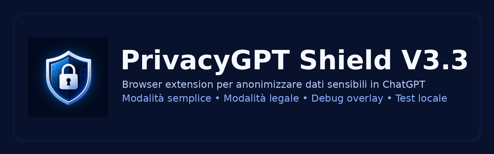
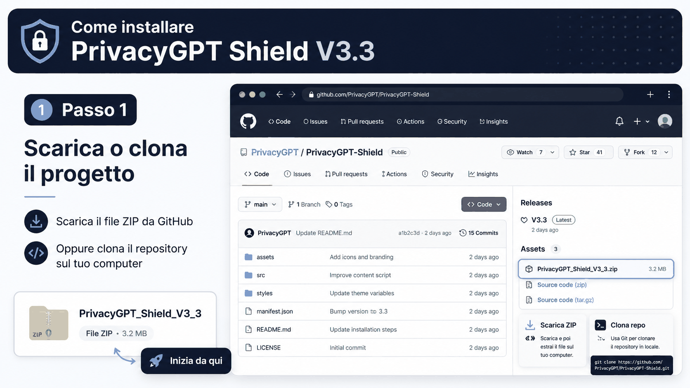

# PrivacyGPT Shield Extension V3.3



**PrivacyGPT Shield Extension V3.3** è una estensione Chrome locale per anonimizzare dati sensibili prima dell'invio a ChatGPT.

Ideato e sviluppato da **Fabio Scialanga**.

## Obiettivo

L'estensione aiuta a ridurre il rischio di inviare accidentalmente a ChatGPT dati personali, aziendali o tecnici non necessari, come email, telefoni, indirizzi, nomi, aziende, URL, IP e credenziali tecniche evidenti.

Tutto il processo di anonimizzazione avviene **localmente nel browser**. L'estensione non invia i contenuti a server esterni.

## Funzioni principali

### Modalità anonimizzazione

#### Semplice
Pensata per un uso prudente e a basso rischio di falsi positivi. Maschera soprattutto dati strutturati:

- email
- URL
- IP
- IBAN
- codice fiscale
- partita IVA
- telefoni

#### Legale
Pensata per documenti, email, contratti e testi più delicati. Aggiunge controlli più estesi su:

- persone in contesti riconoscibili
- indirizzi
- aziende, se l'opzione è attiva
- date e orari
- firme email
- header email come Da, A, Cc
- server, username, password e database in contesti tecnici

### Modalità intervento

#### Manuale
È la modalità consigliata. Mostra un pulsante flottante:

```text
🔒 Anonimizza
```

Il testo viene modificato solo quando l'utente preme il pulsante. Dopo l'anonimizzazione, l'utente può controllare il testo e inviarlo manualmente.

#### Automatica
Replica il comportamento originario dell'estensione. Quando l'utente preme Invio o clicca il pulsante di invio di ChatGPT, l'estensione prova ad anonimizzare il testo prima dell'invio.

### Anonimizza aziende

Opzione per mascherare nomi di società, clienti e fornitori.

Esempio:

```text
Azienda Demo S.r.l.
```

può diventare:

```text
[COMPANY_1]
```

### Debug overlay

Mostra un riquadro tecnico nella pagina ChatGPT con:

- estensione attiva o meno
- modalità anonimizzazione
- modalità intervento
- editor rilevato
- numero di pattern trovati
- ultima azione eseguita

### Test locale

La pagina `test.html` permette di provare il motore senza ChatGPT.

Il test locale usa solo dati fittizi e dimostrativi.


## Demo visuali

### Installazione

La GIF seguente mostra i passaggi principali per installare l'estensione in Chrome in modalità sviluppatore.



### Esempio di utilizzo

La GIF seguente mostra il flusso consigliato in modalità manuale:

1. scrivi o incolla il testo in ChatGPT
2. scegli modalità Legale e Intervento Manuale
3. premi **🔒 Anonimizza**
4. controlla il testo anonimizzato
5. invia manualmente il messaggio


## Installazione locale

1. Scarica o clona il repository.
2. Apri Chrome.
3. Vai su `chrome://extensions`.
4. Attiva **Modalità sviluppatore**.
5. Clicca **Carica estensione non pacchettizzata**.
6. Seleziona la cartella del progetto.
7. Apri ChatGPT e ricarica la pagina.
8. Apri il popup dell'estensione e configura le opzioni.

## Struttura del progetto

```text
privacygpt-shield-extension/
  manifest.json
  content.js
  popup.html
  popup.js
  rules.js
  test.html
  test.js
  README.md
  PRIVACY_POLICY.md
  CHANGELOG.md
  RELEASE_NOTES_v3.3.0.md
  LICENSE
  assets/
    logo_master.png
    github_banner.png
    icon16.png
    icon32.png
    icon48.png
    icon128.png
  docs/
    Guida_Installazione.md
    Guida_GitHub.md
    Documentazione_Tecnica.md
    installazione_privacygpt_v33.gif
    utilizzo_privacygpt_v33.gif
    Esempio_Utilizzo.md
```

## Limiti noti

PrivacyGPT Shield Extension V3.3 usa un motore locale basato su regole e regex. È utile per ridurre il rischio di esposizione dati, ma non garantisce anonimizzazione perfetta in ogni contesto.

Sono possibili:

- falsi positivi
- falsi negativi
- risultati non perfetti su email thread molto lunghe
- necessità di controllo umano prima dell'invio

Per questo la modalità **Manuale** è consigliata.

## Roadmap

### V3.3
Versione stabile con motore regex locale, modalità manuale e automatica.

### V4.0
Possibile integrazione opzionale con un motore locale AI, separato dall'estensione, basato su PrivacyGPT Local Engine.

## Privacy

L'estensione:

- elabora il testo localmente nel browser
- non invia il testo a server esterni
- salva solo impostazioni locali tramite `chrome.storage.local`
- non usa API esterne

Per i dettagli vedi `PRIVACY_POLICY.md`.

## Autore

PrivacyGPT Shield Extension V3.3 è stato ideato e sviluppato da **Fabio Scialanga**.

## Licenza

Questo progetto include una licenza MIT di esempio. Personalizzala in base alle tue esigenze prima della pubblicazione definitiva.
