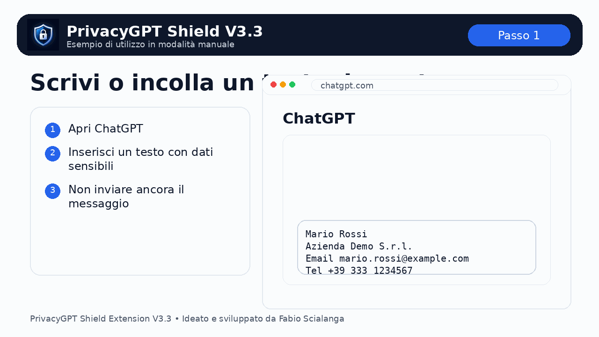

# Esempio di utilizzo PrivacyGPT Shield V3.3

Questa guida mostra come usare l'estensione dopo averla installata in Chrome.

## GIF dimostrativa



## Scenario consigliato

La modalità consigliata è **Manuale**, perché permette di controllare il testo anonimizzato prima dell'invio.

## Procedura

### 1. Apri ChatGPT
Apri ChatGPT e ricarica la pagina dopo aver installato l'estensione.

### 2. Configura il popup
Apri il popup di PrivacyGPT Shield e imposta:

- **Attivo**: ON
- **Modalità anonimizzazione**: Legale, se lavori su email, contratti o documenti riservati
- **Intervento**: Manuale
- **Anonimizza aziende**: ON, se vuoi nascondere anche società, clienti e fornitori
- **Debug overlay**: opzionale

### 3. Scrivi o incolla il testo
Inserisci il testo nell'editor di ChatGPT.

Esempio fittizio:

```text
Mario Rossi
Azienda Demo S.r.l.
Email mario.rossi@example.com
Tel +39 333 1234567
```

### 4. Premi il pulsante Anonimizza
In modalità manuale compare un pulsante flottante:

```text
🔒 Anonimizza
```

Premilo prima di inviare il messaggio.

### 5. Controlla il risultato
Il testo verrà trasformato, ad esempio:

```text
[PERSON_1]
[COMPANY_1]
Email [EMAIL_1]
Tel [PHONE_1]
```

### 6. Invia manualmente
Dopo il controllo, puoi inviare il messaggio a ChatGPT.

## Modalità automatica

In modalità **Automatica**, l'estensione prova ad anonimizzare il testo quando premi Invio o clicchi il pulsante di invio di ChatGPT.

È più veloce, ma meno controllabile. Per testi lunghi o importanti è consigliata la modalità Manuale.

## Nota importante

PrivacyGPT Shield V3.3 usa un motore locale basato su regole. Aiuta a ridurre il rischio di esposizione dati, ma non garantisce anonimizzazione perfetta in ogni contesto.
